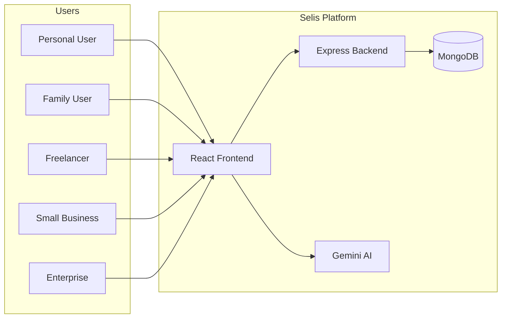
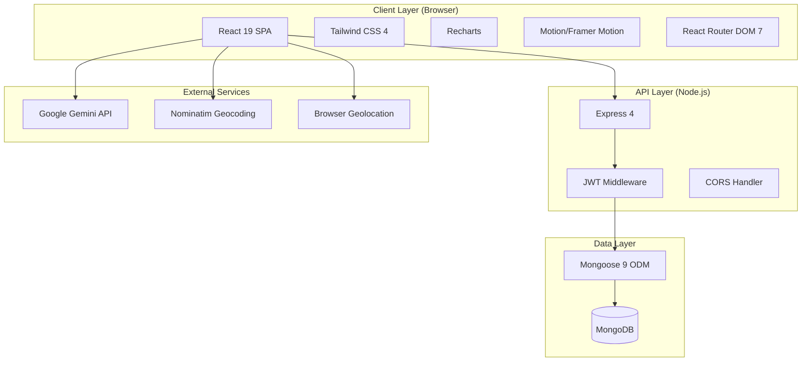

# Software Requirements Specification (SRS)

## Selis — Smart Financial Management Platform

| Field | Detail |
|-------|--------|
| **Document Version** | 2.0 |
| **Date** | 2026-03-29 |
| **Project Name** | Selis — Smart Financial Management Platform |
| **License** | Apache 2.0 |
| **Repository** | Selis_for_ET |

---

## Table of Contents

1. [Introduction](#1-introduction)
2. [Overall Description](#2-overall-description)
3. [System Architecture](#3-system-architecture)
4. [Functional Requirements](#4-functional-requirements)
5. [Non-Functional Requirements](#5-non-functional-requirements)
6. [Data Requirements](#6-data-requirements)
7. [External Interface Requirements](#7-external-interface-requirements)
8. [User Interface Requirements](#8-user-interface-requirements)
9. [Security Requirements](#9-security-requirements)
10. [Plan-Specific Requirements](#10-plan-specific-requirements)
11. [AI & Machine Learning Requirements](#11-ai--machine-learning-requirements)
12. [Testing Requirements](#12-testing-requirements)
13. [Deployment Requirements](#13-deployment-requirements)
14. [Constraints & Assumptions](#14-constraints--assumptions)
15. [Appendices](#15-appendices)

---

## 1. Introduction

### 1.1 Purpose

This Software Requirements Specification (SRS) document provides a comprehensive description of the Selis Smart Financial Management Platform. It details the functional and non-functional requirements, system architecture, data models, external interfaces, and user experience specifications necessary to understand, develop, test, and maintain the system.

### 1.2 Scope

Selis is a web-based financial management platform that provides:

- Multi-plan architecture supporting 5 distinct user segments
- AI-powered financial assistant using Google Gemini
- Real-time financial tracking (transactions, budgets, goals, subscriptions)
- Plan-adaptive dashboards with segment-specific widgets
- Invoice management for business users
- GST and tax estimation for Indian financial context
- Data export capabilities

The platform is built as a full-stack web application with a React SPA frontend and Express REST API backend, backed by MongoDB.

### 1.3 Intended Audience

| Audience | Relevance |
|----------|-----------|
| Developers | Implementation reference, API contracts, data models |
| Project Managers | Feature scope, status tracking, gap analysis |
| QA Engineers | Test case derivation, acceptance criteria |
| UI/UX Designers | Interface specifications, plan-aware UX patterns |
| Stakeholders | Business requirements, feature roadmap |

### 1.4 Definitions & Acronyms

| Term | Definition |
|------|-----------|
| **SPA** | Single Page Application |
| **JWT** | JSON Web Token — stateless authentication mechanism |
| **CRUD** | Create, Read, Update, Delete |
| **API** | Application Programming Interface |
| **CORS** | Cross-Origin Resource Sharing |
| **GST** | Goods and Services Tax (Indian tax system) |
| **NPS** | National Pension System (India) |
| **TDS** | Tax Deducted at Source (India) |
| **INR** | Indian Rupee (₹) |
| **ESM** | ECMAScript Modules |
| **ODM** | Object-Document Mapper (Mongoose) |
| **Sally** | The AI financial assistant persona |

### 1.5 References

| Document | Location |
|----------|----------|
| Architecture Guide | [docs/architecture.md](docs/architecture.md) |
| API Reference | [docs/api-reference.md](docs/api-reference.md) |
| Workflow Guide | [docs/workflows.md](docs/workflows.md) |
| Design System | [docs/design.md](docs/design.md) |
| Integration Guide | [docs/integration-guide.md](docs/integration-guide.md) |
| Deployment Guide | [docs/deployment-guide.md](docs/deployment-guide.md) |

---

## 2. Overall Description

### 2.1 Product Perspective

Selis is a standalone web application designed for the Indian financial context. It serves as a personal and business finance workspace that adapts its interface, features, and AI assistance based on the user's selected plan.



### 2.2 Product Features Summary

| Feature Area | Description | Status |
|-------------|-------------|--------|
| Authentication | Email/password registration and login with JWT |  Implemented |
| Plan Selection | 5 user plans with dynamic UI adaptation |  Implemented |
| Dashboard | Plan-specific overview with stats, charts, widgets |  Implemented |
| Transactions | CRUD with search, filter, AI suggestions, CSV export |  Partial (delete is UI-only) |
| Budgets | Create and track with spending progress |  Partial (no delete/edit) |
| Goals | Create and track financial goals |  Partial (no update/delete) |
| Subscriptions | Full CRUD with monthly cost calculation |  Implemented |
| AI Assistant | Plan-aware financial chat with Gemini |  Implemented |
| Invoices | Invoice listing and management |  Mock data only |
| Tax Estimator | Indian tax liability estimation |  Mock data only |
| GST Tracker | GST input/output tracking |  Mock data only |
| Audit Trail | Enterprise audit logging |  Mock data only |
| Geolocation | Location-aware dashboard widget |  Implemented |

### 2.3 User Classes and Characteristics

#### 2.3.1 Personal Users

- **Profile**: Individuals managing personal finances
- **Needs**: Spending tracking, budget discipline, subscription management, savings goals
- **Technical Level**: Basic to intermediate
- **Access Frequency**: Daily to weekly

#### 2.3.2 Family Users

- **Profile**: Family heads managing household finances
- **Needs**: Kid allowance tracking, joint expense management, shared goals
- **Technical Level**: Basic to intermediate
- **Access Frequency**: Daily to weekly

#### 2.3.3 Freelancer Users

- **Profile**: Self-employed professionals with variable income
- **Needs**: Income smoothing, cash flow prediction, tax estimation, invoice management, retirement planning
- **Technical Level**: Intermediate
- **Access Frequency**: Daily

#### 2.3.4 Small Business Users

- **Profile**: Small business owners (India-focused)
- **Needs**: Cash flow runway monitoring, GST tracking and reporting, vendor management, expense management
- **Technical Level**: Intermediate to advanced
- **Access Frequency**: Daily

#### 2.3.5 Enterprise Users

- **Profile**: Finance teams in mid-to-large organizations
- **Needs**: Department budgets, policy enforcement, approval workflows, P&L reporting, audit trails
- **Technical Level**: Advanced
- **Access Frequency**: Daily

### 2.4 Operating Environment

| Component | Requirement |
|-----------|------------|
| Backend Runtime | Node.js 22+ |
| Package Manager | npm 10+ |
| Database | MongoDB 6+ |
| Frontend Browser | Chrome, Firefox, Safari, Edge (modern versions) |
| Internet | Required for AI features and geolocation |

### 2.5 Design and Implementation Constraints

1. **Indian Financial Context**: All currency formatting uses INR (₹) with Indian numbering system (`en-IN` locale)
2. **Client-Side AI**: Gemini API is called directly from the frontend browser, exposing the API key
3. **No Server-Side Rendering**: The frontend is a pure client-side SPA
4. **ESM Modules**: Backend uses ES modules requiring `.js` extensions in compiled output
5. **Single .env Location**: Both frontend and backend read from a root-level `.env` file
6. **No Database Migrations**: Schema changes require manual database updates

---

## 3. System Architecture

### 3.1 Architecture Overview



### 3.2 Technology Stack

#### Frontend

| Technology | Version | Purpose |
|-----------|---------|---------|
| React | 19.0.0 | UI component framework |
| TypeScript | ~5.8.2 | Type-safe JavaScript |
| Vite | 6.2.0 | Build tool and dev server |
| Tailwind CSS | 4.1.14 | Utility-first CSS framework |
| React Router DOM | 7.13.1 | Client-side routing |
| Recharts | 3.8.0 | Chart library (Area, Pie) |
| Motion | 12.38.0 | Animation library (Framer Motion) |
| Lucide React | 0.546.0 | Icon library |
| @google/genai | 1.29.0 | Gemini AI SDK |
| clsx + tailwind-merge | 2.1.1 / 3.5.0 | Conditional class utilities |
| d3 | 7.9.0 | Data visualization (dependency of Recharts) |

#### Backend

| Technology | Version | Purpose |
|-----------|---------|---------|
| Express | 4.22.1 | HTTP server framework |
| TypeScript | ~5.8.2 | Type-safe JavaScript |
| Mongoose | 9.3.2 | MongoDB ODM |
| jsonwebtoken | 9.0.3 | JWT generation and verification |
| bcryptjs | 3.0.3 | Password hashing |
| cors | 2.8.6 | CORS middleware |
| dotenv | 17.3.1 | Environment variable loading |

### 3.3 Project Structure

```
Selis_for_ET/
 .env                        # Environment variables (root level)
 .env.example                # Template for environment setup
 .gitignore                  # Git ignore rules
 LICENSE                     # Apache 2.0 license
 README.md                   # Project overview
 SRS.md                      # This document

 backend/                    # Express REST API
    server.ts               # Main server: routes, middleware, startup
    lib/
       models.ts           # Mongoose schema definitions
    package.json            # Backend dependencies
    tsconfig.json           # TypeScript config (ES2020, ESM)
    dist/                   # Compiled JavaScript output

 frontend/                   # React SPA
    index.html              # HTML entry point
    vite.config.ts          # Vite config with proxy and Tailwind
    tsconfig.json           # TypeScript config (ES2022, JSX)
    package.json            # Frontend dependencies
    public/
       logo.png            # Application logo
    src/
        main.tsx            # React entry point
        App.tsx             # Root component with routing
        index.css           # Global styles, fonts, theme
        components/
           Auth.tsx        # Login/Register forms
           Layout.tsx      # App shell (sidebar, header)
           Dashboard.tsx   # Overview dashboard
           TransactionList.tsx  # Transaction management
           BudgetBuilder.tsx    # Budget management
           GoalTracker.tsx      # Goal tracking
           InvoiceManager.tsx   # Invoice management (mock)
           AIChat.tsx           # AI assistant chat
           PlanFeature.tsx      # Plan-specific features
        lib/
            api.ts          # HTTP client with auth
            gemini.ts       # Gemini AI wrapper
            currency.ts     # INR formatting utilities
            models.ts       # Mongoose schemas (shared copy)

 docs/                       # Documentation
     README.md               # Documentation hub
     architecture.md         # System architecture
     api-reference.md        # REST API documentation
     workflows.md            # User workflow guide
     design.md               # Design system
     integration-guide.md    # Service integration details
     deployment-guide.md     # Deployment instructions
```

---

## 4. Functional Requirements

### 4.1 Authentication System (FR-AUTH)

#### FR-AUTH-001: User Registration

| Attribute | Detail |
|-----------|--------|
| **ID** | FR-AUTH-001 |
| **Priority** | High |
| **Status** |  Implemented |

**Description**: The system shall allow new users to register with an email address, password, display name, and plan selection.

**Acceptance Criteria**:
1. User provides email (unique), password, name, and plan
2. Password is hashed with bcryptjs (10 salt rounds) before storage
3. System returns JWT token and user profile on success
4. System returns `400` error if email already exists
5. System returns `503` if database is unavailable
6. Default plan is `'personal'` if not specified

#### FR-AUTH-002: User Login

| Attribute | Detail |
|-----------|--------|
| **ID** | FR-AUTH-002 |
| **Priority** | High |
| **Status** |  Implemented |

**Description**: The system shall authenticate existing users with email and password.

**Acceptance Criteria**:
1. User provides email and password
2. System finds user by email and compares password hash
3. Returns JWT token and user profile on success
4. Returns `401` on invalid credentials
5. Returns `503` if database is unavailable

#### FR-AUTH-003: Session Management

| Attribute | Detail |
|-----------|--------|
| **ID** | FR-AUTH-003 |
| **Priority** | High |
| **Status** |  Partial |

**Description**: The system shall maintain user sessions using JWT tokens.

**Acceptance Criteria**:
1. JWT token stored in `localStorage` as `selis_token` 
2. User data stored in `localStorage` as `selis_user` 
3. Token included in `Authorization: Bearer` header for API calls 
4. Protected routes redirect unauthenticated users to `/login` 
5. Token expiration configured  (no `expiresIn` set)
6. Token refresh mechanism  (not implemented)

#### FR-AUTH-004: Logout

| Attribute | Detail |
|-----------|--------|
| **ID** | FR-AUTH-004 |
| **Priority** | High |
| **Status** |  Implemented |

**Description**: Users shall be able to sign out, clearing all session data.

**Acceptance Criteria**:
1. Clicking "Sign Out" removes `selis_token` and `selis_user` from localStorage
2. User is redirected to `/login`
3. Subsequent API calls are rejected with `401`

---

### 4.2 Dashboard System (FR-DASH)

#### FR-DASH-001: Financial Overview

| Attribute | Detail |
|-----------|--------|
| **ID** | FR-DASH-001 |
| **Priority** | High |
| **Status** |  Implemented |

**Description**: The dashboard shall display a real-time financial overview with computed metrics.

**Acceptance Criteria**:
1. Loads transactions and budgets in parallel on mount
2. Displays 3 stat cards: Balance, Income, Expenses
3. Stat card labels adapt based on user plan
4. Values computed client-side from transaction data

#### FR-DASH-002: Plan-Specific Widgets

| Attribute | Detail |
|-----------|--------|
| **ID** | FR-DASH-002 |
| **Priority** | High |
| **Status** |  Partial (mock data) |

**Description**: The dashboard shall render plan-specific widgets based on the user's plan.

**Widgets by Plan**:

| Plan | Widget 1 | Widget 2 | Widget 3 |
|------|----------|----------|----------|
| Personal | Spending Discipline Score (mock) | Emergency Fund Tracker (mock) | Location Widget (real) |
| Family | Kid Allowance Tracker (mock) | Joint Expense Splitter (mock) | Location Widget (real) |
| Freelancer | Cash Flow Gap Detector (mock) | Retirement Planner (mock) | Location Widget (real) |
| Small Business | Cash Flow Runway (mock) | GST Input Credit Tracker (mock) | Location Widget (real) |
| Enterprise | Spend Policy Enforcement (mock) | Headcount Cost Tracker (mock) | Location Widget (real) |

#### FR-DASH-003: Cashflow Chart

| Attribute | Detail |
|-----------|--------|
| **ID** | FR-DASH-003 |
| **Priority** | Medium |
| **Status** |  Hardcoded data |

**Description**: The dashboard shall display an area chart showing income and expense trends over time.

**Current State**: Uses hardcoded 7-month mock data. Should aggregate actual transaction data by month.

#### FR-DASH-004: Category Breakdown

| Attribute | Detail |
|-----------|--------|
| **ID** | FR-DASH-004 |
| **Priority** | Medium |
| **Status** |  Implemented |

**Description**: The dashboard shall display a donut pie chart of expenses by category (top 5).

**Acceptance Criteria**:
1. Groups expense transactions by category
2. Sorts by total amount descending
3. Shows top 5 categories
4. Displays "No expense data available" when empty

#### FR-DASH-005: Recent Transactions

| Attribute | Detail |
|-----------|--------|
| **ID** | FR-DASH-005 |
| **Priority** | Medium |
| **Status** |  Implemented |

**Description**: The dashboard shall show the 5 most recent transactions with a link to the full transactions page.

#### FR-DASH-006: Location Widget

| Attribute | Detail |
|-----------|--------|
| **ID** | FR-DASH-006 |
| **Priority** | Low |
| **Status** |  Implemented |

**Description**: The dashboard shall display the user's current location using browser geolocation and reverse geocoding.

**Acceptance Criteria**:
1. Requests browser geolocation permission
2. On success: fetches address from Nominatim reverse geocoding API
3. Displays: address text, latitude (4 decimal places), longitude (4 decimal places)
4. Shows loading state while detecting
5. Shows error message if permission denied or not supported

---

### 4.3 Transaction Management (FR-TXN)

#### FR-TXN-001: List Transactions

| Attribute | Detail |
|-----------|--------|
| **ID** | FR-TXN-001 |
| **Priority** | High |
| **Status** |  Implemented |

**Description**: The system shall display all user transactions in a sortable table.

**Acceptance Criteria**:
1. Fetches all transactions for authenticated user
2. Displays in table: Description, Category, Date, Amount, Actions
3. Sorted by date (newest first) from API
4. Income shown in green with `+` prefix
5. Expenses shown in neutral color with `-` prefix
6. "No transactions found" message for empty state

#### FR-TXN-002: Search & Filter

| Attribute | Detail |
|-----------|--------|
| **ID** | FR-TXN-002 |
| **Priority** | Medium |
| **Status** |  Implemented |

**Description**: Users shall be able to search and filter transactions.

**Acceptance Criteria**:
1. Search bar filters by description or category (case-insensitive)
2. Type filter: All / Income / Expense
3. Filtering is client-side (real-time, no API call)

#### FR-TXN-003: Create Transaction

| Attribute | Detail |
|-----------|--------|
| **ID** | FR-TXN-003 |
| **Priority** | High |
| **Status** |  Implemented |

**Description**: Users shall be able to create new transactions via a modal form.

**Input Fields**:

| Field | Type | Required | Default |
|-------|------|----------|---------|
| Category | text (with plan-aware datalist) | Yes | — |
| Type | toggle (Expense / Income) | Yes | Expense |
| Description | text | No | Category or 'Transaction' |
| Amount | number | Yes | — |
| Date | date | Yes | Today |

#### FR-TXN-004: AI Description Suggestions

| Attribute | Detail |
|-----------|--------|
| **ID** | FR-TXN-004 |
| **Priority** | Medium |
| **Status** |  Implemented |

**Description**: The system shall provide AI-generated description suggestions when creating transactions.

**Acceptance Criteria**:
1. "Suggest" button enabled when category is filled
2. Calls Gemini with structured JSON output schema
3. Returns 3 short description suggestions
4. Suggestions displayed as clickable chips
5. Clicking a chip fills the description field

#### FR-TXN-005: Delete Transaction

| Attribute | Detail |
|-----------|--------|
| **ID** | FR-TXN-005 |
| **Priority** | High |
| **Status** |  UI-only |

**Description**: Users shall be able to delete transactions.

**Current State**: Delete button shows confirmation dialog and removes from React state only. No backend DELETE endpoint exists. Transaction reappears on page refresh.

#### FR-TXN-006: CSV Export

| Attribute | Detail |
|-----------|--------|
| **ID** | FR-TXN-006 |
| **Priority** | Medium |
| **Status** |  Implemented |

**Description**: Users shall be able to export filtered transactions as a CSV file.

**Acceptance Criteria**:
1. Exports currently filtered transactions
2. CSV headers: Description, Category, Date, Amount, Type
3. Text fields wrapped in quotes
4. Filename: `transactions_YYYY-MM-DD.csv`
5. Generated entirely client-side (no server call)

---

### 4.4 Budget Management (FR-BGT)

#### FR-BGT-001: List Budgets

| Attribute | Detail |
|-----------|--------|
| **ID** | FR-BGT-001 |
| **Priority** | High |
| **Status** |  Implemented |

**Description**: The system shall display all user budgets with spending progress.

**Acceptance Criteria**:
1. Fetches budgets and transactions in parallel
2. Calculates spending per category from expense transactions (case-insensitive match)
3. Shows progress bar: green if under limit, red if over
4. Displays remaining budget or over-limit amount

#### FR-BGT-002: Create Budget

| Attribute | Detail |
|-----------|--------|
| **ID** | FR-BGT-002 |
| **Priority** | High |
| **Status** |  Implemented |

**Description**: Users shall be able to create budgets with a category and monthly limit.

**Input Fields**:

| Field | Type | Required |
|-------|------|----------|
| Category | text (with plan-aware datalist) | Yes |
| Monthly Limit | number | Yes |

#### FR-BGT-003: Delete Budget

| Attribute | Detail |
|-----------|--------|
| **ID** | FR-BGT-003 |
| **Priority** | Medium |
| **Status** |  Not implemented |

**Description**: Users shall be able to delete budgets. Delete button is rendered but non-functional.

---

### 4.5 Goal Tracking (FR-GOAL)

#### FR-GOAL-001: List Goals

| Attribute | Detail |
|-----------|--------|
| **ID** | FR-GOAL-001 |
| **Priority** | High |
| **Status** |  Implemented |

**Description**: The system shall display all financial goals with progress tracking.

**Acceptance Criteria**:
1. Shows goal name, target amount, current amount, deadline
2. Animated progress bar
3. "Completed" badge at 100%+
4. "In Progress" badge for incomplete goals

#### FR-GOAL-002: Create Goal

| Attribute | Detail |
|-----------|--------|
| **ID** | FR-GOAL-002 |
| **Priority** | High |
| **Status** |  Implemented |

**Input Fields**:

| Field | Type | Required |
|-------|------|----------|
| Goal Name | text | Yes |
| Target Amount (₹) | number | Yes |
| Deadline | date | Yes |

#### FR-GOAL-003: Update Goal Progress

| Attribute | Detail |
|-----------|--------|
| **ID** | FR-GOAL-003 |
| **Priority** | Medium |
| **Status** |  Not implemented |

**Description**: Users shall be able to add funds to goals. "Add Funds" button is rendered but non-functional.

---

### 4.6 Subscription Management (FR-SUB)

#### FR-SUB-001: Full CRUD

| Attribute | Detail |
|-----------|--------|
| **ID** | FR-SUB-001 |
| **Priority** | High |
| **Status** |  Implemented |

**Description**: Users shall be able to create, read, and delete subscriptions.

**Acceptance Criteria**:
1. List all subscriptions with name, next billing date, amount, frequency
2. Create via modal form (name, amount, frequency, next billing date)
3. Delete via trash icon button (calls `DELETE /api/subscriptions/:id`)
4. Summary cards: Monthly Total, Active Count, Potential Savings (15%)
5. Annual subscriptions display monthly equivalent (`amount / 12`)

---

### 4.7 AI Assistant (FR-AI)

#### FR-AI-001: Conversational Chat

| Attribute | Detail |
|-----------|--------|
| **ID** | FR-AI-001 |
| **Priority** | High |
| **Status** |  Implemented |

**Description**: The system shall provide a conversational AI financial assistant named "Sally".

**Acceptance Criteria**:
1. Chat interface with user and AI message bubbles
2. Initial greeting includes user name and plan
3. On user message: fetches transactions and budgets for context
4. Sends to Gemini with plan-specific system instruction
5. Responses limited to ~120 words
6. Loading indicator while AI is processing
7. Auto-scroll to latest message
8. Error fallback message on AI failure
9. Disclaimer: "Sally can make mistakes. Verify important financial decisions."

#### FR-AI-002: Plan-Specific AI Context

| Attribute | Detail |
|-----------|--------|
| **ID** | FR-AI-002 |
| **Priority** | High |
| **Status** |  Implemented |

**Description**: The AI assistant shall tailor its responses based on the user's plan.

| Plan | AI Focus Area |
|------|--------------|
| Personal | Lifestyle budgeting, subscription management, personal goals |
| Family | Member-specific spending, shared goals, allowance tracking |
| Freelancer | Income smoothing, tax estimation, invoice follow-ups |
| Small Business | Cash flow runway, GST credits, vendor payments |
| Enterprise | Budget adherence, policy enforcement, departmental variance |

---

### 4.8 Invoice Management (FR-INV)

#### FR-INV-001: Invoice Listing

| Attribute | Detail |
|-----------|--------|
| **ID** | FR-INV-001 |
| **Priority** | Medium |
| **Status** |  Mock data only |

**Description**: The system shall allow freelancer and small business users to manage invoices.

**Current State**: Uses hardcoded mock data. Displays summary cards (Total Outstanding, Paid This Month, Overdue) and an invoice table. Create, Send, Download, and action buttons are non-functional.

---

### 4.9 Settings & Profile (FR-SET)

#### FR-SET-001: Profile Management

| Attribute | Detail |
|-----------|--------|
| **ID** | FR-SET-001 |
| **Priority** | Low |
| **Status** |  Partial (local only) |

**Description**: Users shall be able to update their display name.

**Current State**: Settings modal allows changing display name, but the change is only persisted to `localStorage` — no backend endpoint for profile updates.

---

## 5. Non-Functional Requirements

### 5.1 Performance (NFR-PERF)

| ID | Requirement | Status |
|----|-------------|--------|
| NFR-PERF-001 | Dashboard loads within 2 seconds on standard broadband |  Met (dependent on API response) |
| NFR-PERF-002 | Page transitions complete within 200ms |  Met (Motion animations: 200ms) |
| NFR-PERF-003 | AI assistant responds within 5 seconds |  Dependent on Gemini API latency |
| NFR-PERF-004 | Client-side filtering is instantaneous (<50ms) |  Met (in-memory operations) |

### 5.2 Scalability (NFR-SCALE)

| ID | Requirement | Status |
|----|-------------|--------|
| NFR-SCALE-001 | Support concurrent users with MongoDB |  Supported by architecture |
| NFR-SCALE-002 | Frontend bundle optimized for fast load |  Vite production build with tree-shaking |
| NFR-SCALE-003 | No server-side state required (stateless JWT) |  Met |

### 5.3 Usability (NFR-USE)

| ID | Requirement | Status |
|----|-------------|--------|
| NFR-USE-001 | Responsive design for desktop and tablet |  Met (Tailwind breakpoints) |
| NFR-USE-002 | Consistent visual language across all pages |  Met (design system) |
| NFR-USE-003 | Form fields have visible labels and focus states |  Met |
| NFR-USE-004 | Loading states shown during async operations |  Met |
| NFR-USE-005 | Error messages are human-readable |  Met |
| NFR-USE-006 | Mobile-first responsive layout |  Partial (sidebar not optimized for mobile) |

### 5.4 Reliability (NFR-REL)

| ID | Requirement | Status |
|----|-------------|--------|
| NFR-REL-001 | Health endpoint for monitoring |  `GET /api/health` |
| NFR-REL-002 | Graceful degradation when AI service unavailable |  Fallback error messages |
| NFR-REL-003 | Database connection failure handling |  Auth routes return 503 |

### 5.5 Maintainability (NFR-MAINT)

| ID | Requirement | Status |
|----|-------------|--------|
| NFR-MAINT-001 | TypeScript used throughout for type safety |  Met |
| NFR-MAINT-002 | Modular component architecture |  9 components, 4 lib modules |
| NFR-MAINT-003 | Environment-based configuration |  .env with dotenv |
| NFR-MAINT-004 | Comprehensive documentation |  7 doc files + SRS |

---

## 6. Data Requirements

### 6.1 Data Model

5 MongoDB collections with the following schemas:

#### 6.1.1 User Collection

| Field | Type | Constraints | Description |
|-------|------|------------|-------------|
| `_id` | ObjectId | Auto-generated | Primary key |
| `email` | String | Unique, Required | User email address |
| `password` | String | Required | bcrypt-hashed password |
| `name` | String | Required | Display name |
| `plan` | String | Default: `'personal'` | User plan type |
| `createdAt` | Date | Auto-generated | Creation timestamp |
| `updatedAt` | Date | Auto-generated | Last update timestamp |

**Valid Plan Values**: `personal`, `family`, `freelancer`, `small_business`, `enterprise`

#### 6.1.2 Transaction Collection

| Field | Type | Constraints | Description |
|-------|------|------------|-------------|
| `_id` | ObjectId | Auto-generated | Primary key |
| `userId` | ObjectId | Required, Ref: User | Owner user |
| `amount` | Number | Required | Transaction amount |
| `category` | String | Required | Category name |
| `date` | String | Required | ISO date string |
| `description` | String | Optional | Transaction description |
| `type` | String | Required, Enum: `['income', 'expense']` | Transaction type |
| `planContext` | String | Optional | User plan at creation |
| `createdAt` | Date | Auto-generated | Creation timestamp |
| `updatedAt` | Date | Auto-generated | Last update timestamp |

#### 6.1.3 Budget Collection

| Field | Type | Constraints | Description |
|-------|------|------------|-------------|
| `_id` | ObjectId | Auto-generated | Primary key |
| `userId` | ObjectId | Required, Ref: User | Owner user |
| `category` | String | Required | Budget category |
| `limitAmount` | Number | Required | Monthly spending limit |
| `planContext` | String | Optional | User plan at creation |
| `createdAt` | Date | Auto-generated | Creation timestamp |
| `updatedAt` | Date | Auto-generated | Last update timestamp |

#### 6.1.4 Goal Collection

| Field | Type | Constraints | Description |
|-------|------|------------|-------------|
| `_id` | ObjectId | Auto-generated | Primary key |
| `userId` | ObjectId | Required, Ref: User | Owner user |
| `name` | String | Required | Goal name |
| `targetAmount` | Number | Required | Target amount |
| `currentAmount` | Number | Default: `0` | Current saved amount |
| `deadline` | String | Optional | Target date |
| `planContext` | String | Optional | User plan at creation |
| `createdAt` | Date | Auto-generated | Creation timestamp |
| `updatedAt` | Date | Auto-generated | Last update timestamp |

#### 6.1.5 Subscription Collection

| Field | Type | Constraints | Description |
|-------|------|------------|-------------|
| `_id` | ObjectId | Auto-generated | Primary key |
| `userId` | ObjectId | Required, Ref: User | Owner user |
| `name` | String | Required | Service name |
| `amount` | Number | Required | Subscription cost |
| `frequency` | String | Required, Enum: `['monthly', 'annual']` | Billing frequency |
| `nextBillingDate` | String | Optional | Next billing date |
| `planContext` | String | Optional | User plan at creation |
| `createdAt` | Date | Auto-generated | Creation timestamp |
| `updatedAt` | Date | Auto-generated | Last update timestamp |

### 6.2 Data Integrity

1. All financial data is scoped to user via `userId` foreign key
2. Email uniqueness enforced at the database level
3. Passwords are never stored in plain text
4. Timestamps are automatically managed by Mongoose

### 6.3 Data Volume Estimates

| Collection | Expected Records per User | Notes |
|-----------|--------------------------|-------|
| Transactions | 50-500 per month | Highest volume collection |
| Budgets | 5-15 total | One per spending category |
| Goals | 3-10 total | Long-term items |
| Subscriptions | 5-20 total | Recurring services |

---

## 7. External Interface Requirements

### 7.1 Google Gemini API

| Attribute | Detail |
|-----------|--------|
| **SDK** | `@google/genai` v1.29.0+ |
| **Model** | `gemini-3-flash-preview` |
| **Auth** | API key via `VITE_GEMINI_API_KEY` |
| **Call Origin** | Client-side (browser) |
| **Use Cases** | Financial chat assistant, transaction description suggestions |
| **Response Format** | Text (chat) or JSON (suggestions via structured output) |

### 7.2 Nominatim Geocoding API

| Attribute | Detail |
|-----------|--------|
| **Endpoint** | `https://nominatim.openstreetmap.org/reverse` |
| **Parameters** | `format=json&lat={lat}&lon={lng}` |
| **Auth** | None (free service) |
| **Rate Limits** | 1 request/second (OpenStreetMap policy) |
| **Response Used** | `display_name` field |

### 7.3 Browser APIs

| API | Usage |
|-----|-------|
| `navigator.geolocation` | Location detection for dashboard widget |
| `localStorage` | JWT token and user data persistence |
| `Intl.NumberFormat` | INR currency formatting |
| `Blob / URL.createObjectURL` | CSV file generation and download |

---

## 8. User Interface Requirements

### 8.1 Page Inventory

| Page | Route | Component | Description |
|------|-------|-----------|-------------|
| Login/Register | `/login` | Auth.tsx | Authentication forms |
| Dashboard | `/` | Dashboard.tsx | Financial overview |
| Budgets | `/budgets` | BudgetBuilder.tsx | Budget management |
| Transactions | `/transactions` | TransactionList.tsx | Transaction management |
| Goals | `/goals` | GoalTracker.tsx | Goal tracking |
| Invoices | `/invoices` | InvoiceManager.tsx | Invoice management |
| AI Assistant | `/ai` | AIChat.tsx | AI chat interface |
| Subscriptions | `/subscriptions` | PlanFeature.tsx | Subscription tracking |
| Plan Features | `/allowance`, `/income`, etc. | PlanFeature.tsx | Plan-specific pages |

### 8.2 Navigation Architecture

- **Sidebar**: Collapsible (280px ↔ 80px), plan-aware navigation items
- **Header**: Sticky with backdrop blur, shows current page name, settings icon, logout, user avatar
- **Page Transitions**: AnimatePresence with fade + slide (200ms)

### 8.3 Design Tokens

| Token | Value |
|-------|-------|
| Font Family (Sans) | Inter |
| Font Family (Mono) | JetBrains Mono |
| Primary Color | Emerald-500 (#10b981) |
| Card Border Radius | 16px (rounded-2xl) |
| Button Border Radius | 12px (rounded-xl) |
| Page Max Width | 80rem (max-w-7xl) |
| Page Padding | 32px (p-8) |

### 8.4 Responsive Breakpoints

| Breakpoint | Tailwind Class | Usage |
|-----------|---------------|-------|
| Mobile | Default | Single column layouts |
| Tablet | `md:` (768px+) | 2-3 column grids |
| Desktop | `lg:` (1024px+) | Full layouts with sidebar |

---

## 9. Security Requirements

### 9.1 Implemented Security

| Requirement | Implementation | Status |
|-------------|---------------|--------|
| Password hashing | bcryptjs with 10 salt rounds |  |
| Token-based auth | JWT in Authorization header |  |
| User data isolation | All queries filtered by `userId` |  |
| CORS protection | Dynamic origin validation in production |  |
| Input format validation | Mongoose schema enforcement |  |

### 9.2 Security Gaps & Recommendations

| Gap | Risk | Recommendation |
|-----|------|----------------|
| JWT stored in localStorage | XSS attack vector | Use httpOnly cookies |
| No JWT expiration | Tokens valid indefinitely | Add `expiresIn: '7d'` |
| No rate limiting | Brute force attacks | Add `express-rate-limit` |
| No input sanitization | Potential injection | Add `express-validator` or `zod` |
| Gemini API key in client | Key exposure | Proxy AI calls through backend |
| No HTTPS enforcement | Data interception | Enable TLS in production |
| No CSRF protection | Cross-site request forgery | Add CSRF token middleware |

---

## 10. Plan-Specific Requirements

### 10.1 Personal Plan

| Feature | Type | Status |
|---------|------|--------|
| Dashboard stats | Dynamic |  Real data |
| Spending Discipline Score | Widget |  Mock (hardcoded 84) |
| Emergency Fund Tracker | Widget |  Mock (hardcoded ₹12,500/₹25,000) |
| Budgets | Page |  Functional |
| Transactions | Page |  Functional |
| Subscriptions | Page |  Functional (full CRUD) |
| Goals | Page |  Partial (create/read only) |
| AI Chat | Page |  Functional |

### 10.2 Family Plan

| Feature | Type | Status |
|---------|------|--------|
| Dashboard stats | Dynamic |  Real data |
| Kid Allowance Tracker | Widget |  Mock (Aarav, Priya) |
| Joint Expense Splitter | Widget |  Mock (hardcoded ₹1,250) |
| Allowance Page | Plan Feature |  Mock data |
| Budgets | Page |  Functional |
| Transactions | Page |  Functional |
| Goals | Page |  Partial |
| AI Chat | Page |  Functional |

### 10.3 Freelancer Plan

| Feature | Type | Status |
|---------|------|--------|
| Dashboard stats | Dynamic |  Real data |
| Cash Flow Gap Detector | Widget |  Mock |
| Retirement Planner | Widget |  Mock |
| Invoices | Page |  Mock data |
| Income Tracker | Plan Feature |  Mock data with bar chart |
| Tax Estimator | Plan Feature |  Mock data |
| Retirement Page | Plan Feature |  Placeholder |
| AI Chat | Page |  Functional |

### 10.4 Small Business Plan

| Feature | Type | Status |
|---------|------|--------|
| Dashboard stats | Dynamic |  Real data |
| Cash Flow Runway | Widget |  Mock (4.2 months) |
| GST Input Credit Tracker | Widget |  Mock (₹34,000) |
| Invoices | Page |  Mock data |
| Expenses | Page |  Functional (TransactionList) |
| GST Tracker | Plan Feature |  Mock data |
| Vendors | Plan Feature |  Placeholder |
| AI Chat | Page |  Functional |

### 10.5 Enterprise Plan

| Feature | Type | Status |
|---------|------|--------|
| Dashboard stats | Dynamic |  Real data |
| Spend Policy Enforcement | Widget |  Mock (3 violations) |
| Headcount Cost Tracker | Widget |  Mock (62%) |
| Dept Budgets | Page |  Functional (BudgetBuilder) |
| Approvals | Plan Feature |  Placeholder |
| P&L Reports | Plan Feature |  Placeholder |
| Audit Trail | Plan Feature |  Mock data |
| AI Chat | Page |  Functional |

---

## 11. AI & Machine Learning Requirements

### 11.1 AI Model Configuration

| Attribute | Value |
|-----------|-------|
| Provider | Google (via @google/genai SDK) |
| Model | `gemini-3-flash-preview` |
| Max Response | ~120 words (instruction-enforced) |
| Temperature | Default (not explicitly set) |
| Context Window | User's full transaction + budget data |

### 11.2 System Prompt Architecture

The AI receives a dynamically constructed system instruction containing:
1. Persona definition ("You are Sally, a financial assistant for Selis")
2. Response constraints (concise, ≤120 words, conversational but professional)
3. Plan-specific focus area with example responses
4. User's current financial data (transactions + budgets as JSON)

### 11.3 AI Use Cases

| Use Case | Component | Input | Output |
|----------|-----------|-------|--------|
| Financial advice chat | AIChat.tsx | Natural language question | Text response |
| Transaction description suggestions | TransactionList.tsx | Category + type | JSON array of 3 strings |

### 11.4 AI Guardrails

1. Response length limited by system instruction
2. UI disclaimer warns users to verify important decisions
3. Error fallback prevents app crashes on AI failure
4. No user data sent to AI backend (all client-side)

---

## 12. Testing Requirements

### 12.1 Current State

The project currently has **no automated tests**. Testing is manual only.

### 12.2 Manual Test Cases

| ID | Test Case | Steps | Expected Result |
|----|-----------|-------|-----------------|
| TC-001 | User registration | Register with valid email/password | Token returned, redirected to dashboard |
| TC-002 | Duplicate email | Register with existing email | Error "Email already exists" |
| TC-003 | User login | Login with valid credentials | Token returned, redirected to dashboard |
| TC-004 | Invalid login | Login with wrong password | Error "Invalid credentials" |
| TC-005 | Create transaction | Fill form, submit | Transaction appears in list |
| TC-006 | Search transactions | Type in search box | List filters in real-time |
| TC-007 | Filter by type | Select Income/Expense | List shows only matching type |
| TC-008 | Create budget | Fill category and limit | Budget card appears |
| TC-009 | Budget over-limit | Add expenses exceeding budget | Red progress bar + warning |
| TC-010 | Create goal | Set name, target, deadline | Goal card appears |
| TC-011 | Create subscription | Fill form, submit | Subscription appears in table |
| TC-012 | Delete subscription | Click delete icon | Removed from table and database |
| TC-013 | AI chat | Send message | AI responds with financial advice |
| TC-014 | CSV export | Click Export button | CSV file downloaded |
| TC-015 | Logout | Click Sign Out | Redirected to login page |
| TC-016 | Plan nav items | Login with each plan | Navigation shows correct items |

### 12.3 Recommended Test Infrastructure

| Type | Tool | Coverage |
|------|------|----------|
| Unit tests | Vitest | Utility functions (currency, API client) |
| Component tests | React Testing Library | Component rendering and interaction |
| API tests | Supertest | Backend endpoint validation |
| E2E tests | Playwright | Full user flow testing |

---

## 13. Deployment Requirements

### 13.1 Development Environment

| Component | Configuration |
|-----------|---------------|
| Backend | `npm run dev` (tsc-watch + auto-restart) |
| Frontend | `npm run dev` (Vite HMR on port 5173) |
| Database | Local MongoDB or Atlas free tier |
| Proxy | Vite proxies `/api` to `localhost:3000` |

### 13.2 Production Environment

| Component | Configuration |
|-----------|---------------|
| Backend | `npx tsc && NODE_ENV=production node dist/server.js` |
| Frontend | `npm run build` → serve `dist/` with static server |
| Database | MongoDB Atlas or dedicated MongoDB instance |
| HTTPS | Required (via reverse proxy or hosting platform) |
| Monitoring | Health endpoint: `GET /api/health` |

### 13.3 Environment Variables

See [Section 7 of Integration Guide](docs/integration-guide.md) for complete variable reference.

---

## 14. Constraints & Assumptions

### 14.1 Constraints

1. Single-tenant architecture (no multi-organization support)
2. All currency is Indian Rupee (INR) — no multi-currency support
3. Client-side AI calls expose API key in browser bundle
4. No offline support or service workers
5. No server-side pagination (all data loaded at once)
6. No real-time updates (requires manual refresh for multi-device sync)
7. Date fields stored as strings, not Date objects

### 14.2 Assumptions

1. Users have modern browsers with JavaScript enabled
2. MongoDB is available and accessible at startup
3. Gemini API key is valid and has sufficient quota
4. Users will primarily access via desktop or tablet browsers
5. Internet connectivity is available for all features
6. Data volumes per user remain within reasonable limits (<10,000 transactions)

### 14.3 Dependencies

| Dependency | Type | Risk |
|-----------|------|------|
| Google Gemini API | External service | Service availability, pricing changes |
| Nominatim / OpenStreetMap | External service | Rate limiting, service availability |
| MongoDB | Database | Connection reliability |
| npm packages | Build dependency | Version compatibility |
| Browser Geolocation | Browser API | User permission required |

---

## 15. Appendices

### Appendix A: API Endpoint Summary

| Method | Endpoint | Auth | Description |
|--------|----------|------|-------------|
| GET | `/api/health` | No | Server health check |
| POST | `/api/auth/register` | No | User registration |
| POST | `/api/auth/login` | No | User login |
| GET | `/api/transactions` | Yes | List transactions |
| POST | `/api/transactions` | Yes | Create transaction |
| GET | `/api/budgets` | Yes | List budgets |
| POST | `/api/budgets` | Yes | Create budget |
| GET | `/api/goals` | Yes | List goals |
| POST | `/api/goals` | Yes | Create goal |
| GET | `/api/subscriptions` | Yes | List subscriptions |
| POST | `/api/subscriptions` | Yes | Create subscription |
| DELETE | `/api/subscriptions/:id` | Yes | Delete subscription |

### Appendix B: Route Map

| Route | Component | Auth | Available Plans |
|-------|-----------|------|----------------|
| `/login` | Auth | No | All |
| `/` | Dashboard | Yes | All |
| `/budgets` | BudgetBuilder | Yes | personal, family, enterprise |
| `/transactions` | TransactionList | Yes | personal, family, small_business |
| `/goals` | GoalTracker | Yes | personal, family |
| `/invoices` | InvoiceManager | Yes | freelancer, small_business |
| `/ai` | AIChat | Yes | All |
| `/subscriptions` | PlanFeature | Yes | personal |
| `/allowance` | PlanFeature | Yes | family |
| `/income` | PlanFeature | Yes | freelancer |
| `/tax` | PlanFeature | Yes | freelancer |
| `/retirement` | PlanFeature | Yes | freelancer |
| `/gst` | PlanFeature | Yes | small_business |
| `/vendors` | PlanFeature | Yes | small_business |
| `/approvals` | PlanFeature | Yes | enterprise |
| `/reports` | PlanFeature | Yes | enterprise |
| `/audit` | PlanFeature | Yes | enterprise |

### Appendix C: Feature Implementation Status Matrix

| Feature | Backend API | Frontend UI | Real Data | Full CRUD |
|---------|-------------|-------------|-----------|-----------|
| Authentication |  |  |  |  |
| Transactions |  (no delete) |  |  |  |
| Budgets |  (no delete/edit) |  |  |  |
| Goals |  (no update/delete) |  |  |  |
| Subscriptions |  |  |  |  |
| AI Chat | N/A (client-side) |  |  | N/A |
| Invoices |  |  (mock) |  |  |
| Plan Widgets | N/A |  (mock) |  | N/A |
| Settings |  |  (local) |  |  |

---

*End of Software Requirements Specification*
