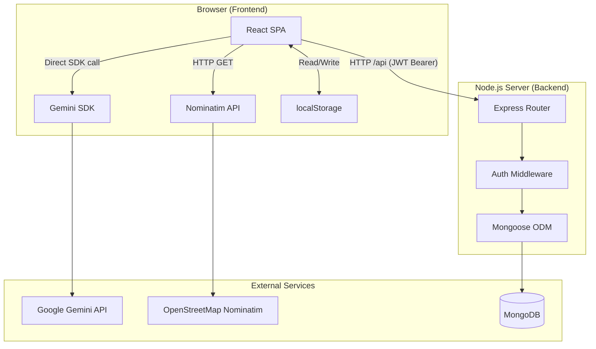
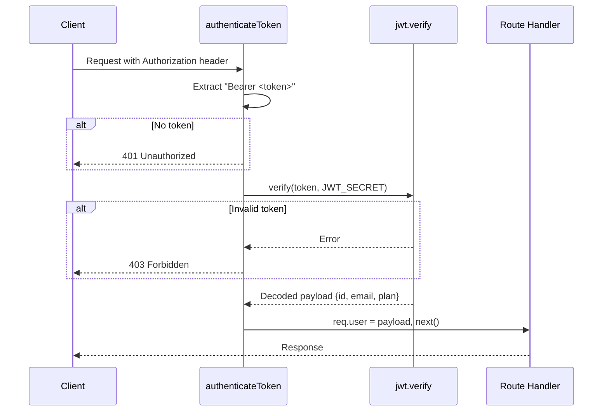
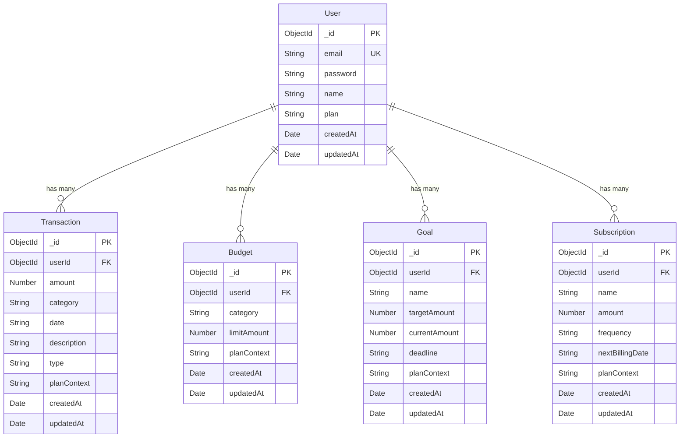
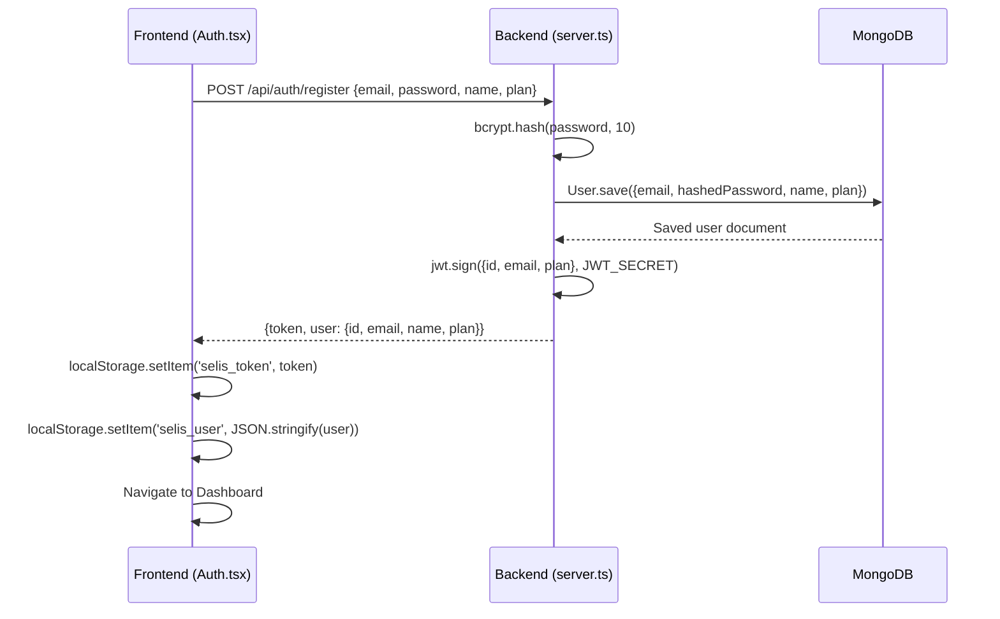
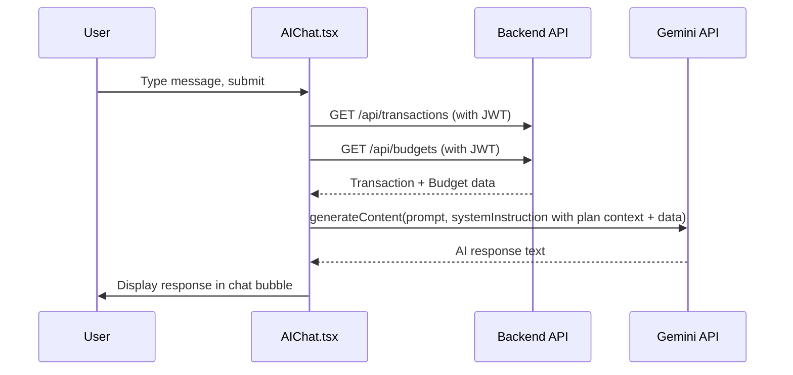

# Architecture

Back to [Docs Home](README.md) | Next: [Workflow Guide](workflows.md)

## System Overview

Selis is a full-stack, plan-adaptive financial management platform. Its architecture separates concerns across a React SPA frontend and an Express REST API backend, with MongoDB for persistence and Google Gemini for AI capabilities.

| Layer | Technology | Purpose |
|-------|-----------|---------|
| Frontend | React 19 + Vite 6 + TypeScript | SPA with plan-aware UI |
| Styling | Tailwind CSS 4 + Inter/JetBrains Mono | Design system |
| Animation | Motion (Framer Motion) | Smooth transitions and micro-interactions |
| Charts | Recharts 3 | Financial data visualization |
| Routing | React Router DOM 7 | Client-side navigation with auth guards |
| Backend | Express 4 + TypeScript (ESM) | REST API server |
| Database | MongoDB + Mongoose 9 | Document-based persistence |
| Authentication | JWT + bcryptjs | Stateless token-based auth |
| AI | Google Gemini 3 Flash Preview | Financial assistant and suggestions |
| Geolocation | Browser API + Nominatim | Location-aware dashboard widget |

## High-Level Architecture



### Key Architectural Decisions

1. **Client-side AI calls**: Gemini API is called directly from the frontend (not proxied through the backend), using `VITE_GEMINI_API_KEY`. This simplifies the backend but exposes the API key in the client bundle.
2. **Plan-driven UI**: The `user.plan` field (stored in JWT and localStorage) drives navigation, dashboard widgets, feature pages, and AI prompt context — all resolved at render time.
3. **Token in localStorage**: JWT tokens are stored in `localStorage` (keys: `selis_token`, `selis_user`). Simple and effective but susceptible to XSS.
4. **Vite Dev Proxy**: In development, `/api` requests are proxied from `localhost:5173` to `localhost:3000` via Vite config, eliminating CORS issues during development.

## Frontend Architecture

### Entry Point & Bootstrap

```
index.html → main.tsx → App.tsx → Router → Layout → Page Components
```

- **main.tsx**: Creates React root with StrictMode, imports global CSS
- **App.tsx**: Manages auth state, defines all routes, handles login/logout/updateUser
- **Layout.tsx**: Provides collapsible sidebar, sticky header, settings modal, and `<Outlet>` for page content

### Component Map

| Component | File | Responsibility |
|-----------|------|---------------|
| `Auth` | [Auth.tsx](../frontend/src/components/Auth.tsx) | Login/Register forms with plan selection |
| `Layout` | [Layout.tsx](../frontend/src/components/Layout.tsx) | App shell: sidebar, header, settings, navigation |
| `Dashboard` | [Dashboard.tsx](../frontend/src/components/Dashboard.tsx) | Overview with stats cards, charts, plan widgets, location |
| `TransactionList` | [TransactionList.tsx](../frontend/src/components/TransactionList.tsx) | Transaction CRUD, search, filter, CSV export, AI suggestions |
| `BudgetBuilder` | [BudgetBuilder.tsx](../frontend/src/components/BudgetBuilder.tsx) | Budget creation and spending progress tracking |
| `GoalTracker` | [GoalTracker.tsx](../frontend/src/components/GoalTracker.tsx) | Financial goal management with progress visualization |
| `InvoiceManager` | [InvoiceManager.tsx](../frontend/src/components/InvoiceManager.tsx) | Invoice listing and management (mock data) |
| `AIChat` | [AIChat.tsx](../frontend/src/components/AIChat.tsx) | Conversational AI interface with Gemini |
| `PlanFeature` | [PlanFeature.tsx](../frontend/src/components/PlanFeature.tsx) | Plan-specific feature pages (subscriptions, tax, GST, etc.) |

### Utility Modules

| Module | File | Purpose |
|--------|------|---------|
| `api` | [api.ts](../frontend/src/lib/api.ts) | HTTP client with JWT auth injection and error handling |
| `gemini` | [gemini.ts](../frontend/src/lib/gemini.ts) | Gemini wrapper with plan-specific system instructions |
| `currency` | [currency.ts](../frontend/src/lib/currency.ts) | INR formatting with `Intl.NumberFormat` |
| `models` | [models.ts](../frontend/src/lib/models.ts) | Shared Mongoose schema definitions (duplicated from backend) |

### Route Map

| Path | Component | Auth Required | Plan Scope |
|------|-----------|---------------|------------|
| `/login` | Auth | No | All |
| `/` | Dashboard | Yes | All |
| `/budgets` | BudgetBuilder | Yes | personal, family, enterprise |
| `/transactions` | TransactionList | Yes | personal, family, small_business |
| `/goals` | GoalTracker | Yes | personal, family |
| `/invoices` | InvoiceManager | Yes | freelancer, small_business |
| `/ai` | AIChat | Yes | All |
| `/subscriptions` | PlanFeature | Yes | personal |
| `/allowance` | PlanFeature | Yes | family |
| `/income` | PlanFeature | Yes | freelancer |
| `/tax` | PlanFeature | Yes | freelancer |
| `/retirement` | PlanFeature | Yes | freelancer |
| `/gst` | PlanFeature | Yes | small_business |
| `/vendors` | PlanFeature | Yes | small_business |
| `/approvals` | PlanFeature | Yes | enterprise |
| `/reports` | PlanFeature | Yes | enterprise |
| `/audit` | PlanFeature | Yes | enterprise |

## Backend Architecture

### Server Structure

```
backend/
 server.ts          # Express app, routes, middleware, MongoDB connection
 lib/
    models.ts      # Mongoose schema definitions (5 models)
 package.json       # Dependencies and scripts
 tsconfig.json      # TypeScript configuration (ESM, ES2020 target)
```

### Route Architecture

All routes are defined in [server.ts](../backend/server.ts):

| Domain | Method | Endpoint | Auth | Description |
|--------|--------|----------|------|-------------|
| Health | GET | `/api/health` | No | Server and MongoDB status |
| Auth | POST | `/api/auth/register` | No | User registration |
| Auth | POST | `/api/auth/login` | No | User login |
| Transactions | GET | `/api/transactions` | Yes | List user transactions (sorted by date desc) |
| Transactions | POST | `/api/transactions` | Yes | Create a transaction |
| Budgets | GET | `/api/budgets` | Yes | List user budgets |
| Budgets | POST | `/api/budgets` | Yes | Create a budget |
| Goals | GET | `/api/goals` | Yes | List user goals |
| Goals | POST | `/api/goals` | Yes | Create a goal |
| Subscriptions | GET | `/api/subscriptions` | Yes | List user subscriptions |
| Subscriptions | POST | `/api/subscriptions` | Yes | Create a subscription |
| Subscriptions | DELETE | `/api/subscriptions/:id` | Yes | Delete a subscription |

### Authentication Middleware



### CORS Configuration

The server uses a dynamic CORS origin resolver:

- **Development**: All origins are allowed (`NODE_ENV !== 'production'`)
- **Production**: Only whitelisted origins are permitted:
  - `http://localhost:5173`, `http://localhost:3000`
  - `https://8qvhlfbw-5173.inc1.devtunnels.ms`
  - `http://127.0.0.1:5173`, `http://127.0.0.1:3000`
- Requests with no origin (mobile apps, cURL) are always allowed

## Data Model



### Field Constraints

| Model | Field | Constraint |
|-------|-------|-----------|
| User | email | unique, required |
| User | password | required (hashed with bcryptjs) |
| User | plan | default: `'personal'` |
| Transaction | type | enum: `['income', 'expense']` |
| Subscription | frequency | enum: `['monthly', 'annual']` |
| All models | timestamps | Auto-generated `createdAt`, `updatedAt` |

## Runtime Flows

### Registration Flow



### AI Chat Flow



## Notable Constraints

- Backend uses ESM modules and requires explicit `.js` runtime imports (e.g., `./lib/models.js`).
- Frontend proxies `/api` to the backend in dev via [vite.config.ts](../frontend/vite.config.ts).
- TypeScript is compiled to `backend/dist/` using `npx tsc -p tsconfig.json`.
- The `.env` file is loaded from the project root (`../`) relative to the backend directory.
- All date fields in the data model are stored as strings (ISO format), not Date objects.

## Related Docs

- [API Reference](api-reference.md)
- [Integration Guide](integration-guide.md)
- [Deployment Guide](deployment-guide.md)
- [SRS Document](../SRS.md)
