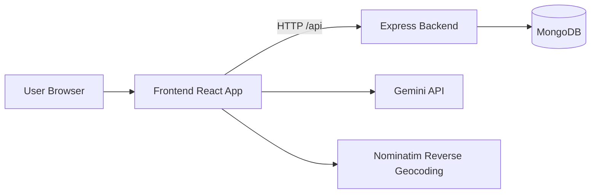
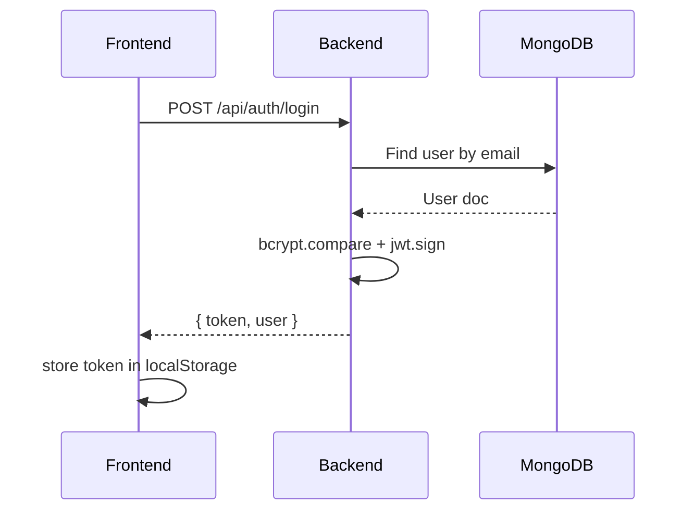
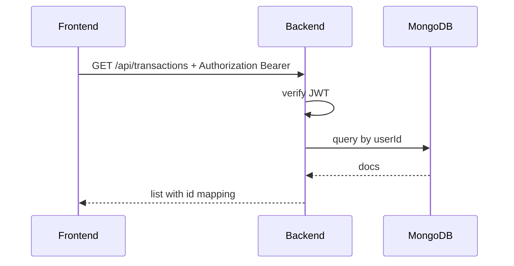

# Architecture

Back to [Docs Home](README.md) | Next: [Workflow Guide](workflows.md)

## System Overview

Selis is a full-stack financial platform with:

- Frontend: React 19 + Vite + TypeScript
- Backend: Express + TypeScript (ESM)
- Data Store: MongoDB via Mongoose
- Auth: JWT bearer tokens
- AI: Gemini via `@google/genai`

## High-Level Architecture

## Frontend Modules

- App shell and routing: [frontend/src/App.tsx](../frontend/src/App.tsx)
- Role/plan-aware layout and navigation: [frontend/src/components/Layout.tsx](../frontend/src/components/Layout.tsx)
- Core pages:
  - Dashboard: [frontend/src/components/Dashboard.tsx](../frontend/src/components/Dashboard.tsx)
  - Transactions: [frontend/src/components/TransactionList.tsx](../frontend/src/components/TransactionList.tsx)
  - Budgets: [frontend/src/components/BudgetBuilder.tsx](../frontend/src/components/BudgetBuilder.tsx)
  - Goals: [frontend/src/components/GoalTracker.tsx](../frontend/src/components/GoalTracker.tsx)
  - Invoices: [frontend/src/components/InvoiceManager.tsx](../frontend/src/components/InvoiceManager.tsx)
  - AI Chat: [frontend/src/components/AIChat.tsx](../frontend/src/components/AIChat.tsx)
  - Plan features: [frontend/src/components/PlanFeature.tsx](../frontend/src/components/PlanFeature.tsx)
- API client: [frontend/src/lib/api.ts](../frontend/src/lib/api.ts)
- Gemini wrapper: [frontend/src/lib/gemini.ts](../frontend/src/lib/gemini.ts)

## Backend Modules

- Server and routes: [backend/server.ts](../backend/server.ts)
- Mongoose models: [backend/lib/models.ts](../backend/lib/models.ts)

### Route Domains

- Health: `/api/health`
- Auth: `/api/auth/*`
- Transactions: `/api/transactions`
- Budgets: `/api/budgets`
- Goals: `/api/goals`
- Subscriptions: `/api/subscriptions`

## Data Model

Collections and key fields:

- User: `email`, `password`, `name`, `plan`
- Transaction: `userId`, `amount`, `category`, `date`, `description`, `type`, `planContext`
- Budget: `userId`, `category`, `limitAmount`, `planContext`
- Goal: `userId`, `name`, `targetAmount`, `currentAmount`, `deadline`, `planContext`
- Subscription: `userId`, `name`, `amount`, `frequency`, `nextBillingDate`, `planContext`

## Runtime Flow (Auth)

## Runtime Flow (Protected API)

## Notable Constraints

- Backend uses ESM and requires explicit `.js` runtime imports in emitted code (for example `./lib/models.js`).
- Frontend proxies `/api` to backend in dev via [frontend/vite.config.ts](../frontend/vite.config.ts).

## Related Docs

- [API Reference](api-reference.md)
- [Integration Guide](integration-guide.md)
- [Deployment Guide](deployment-guide.md)
