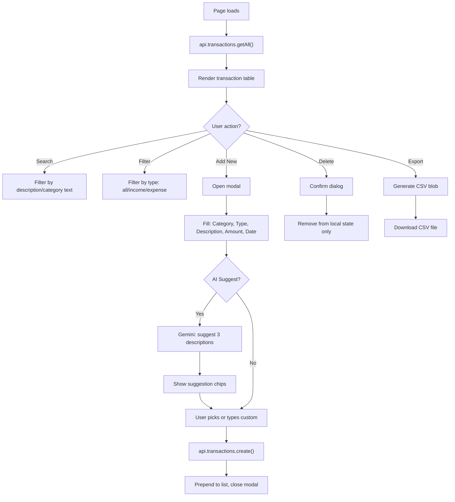
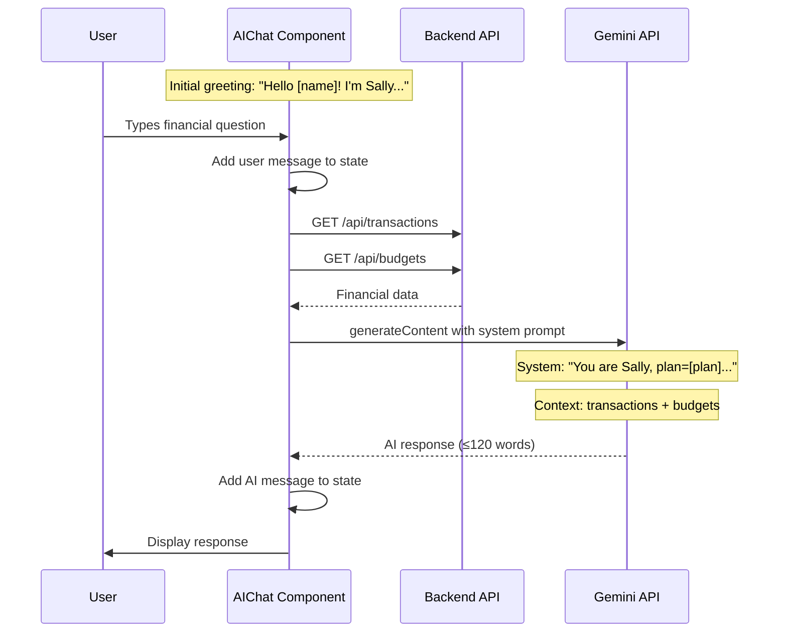

# Workflow Guide

Back to [Docs Home](README.md) | Related: [API Reference](api-reference.md) | [Architecture](architecture.md)

This guide documents every major user workflow in Selis, tracing the path from user interaction through frontend components to backend API calls.

---

## 1. Authentication

### Entry Points
- Login/Register form: [Auth.tsx](../frontend/src/components/Auth.tsx)
- Auth state management: [App.tsx](../frontend/src/App.tsx)
- Route guards: [App.tsx](../frontend/src/App.tsx) (uses `<Navigate>` for redirects)

### Registration Flow

```mermaid
flowchart TD
  A[User opens /login] --> B{Has account?}
  B -->|No| C[Click 'Sign Up']
  C --> D[Fill: Name, Email, Password, Plan]
  D --> E[Submit form]
  E --> F["api.auth.register()"]
  F --> G["POST /api/auth/register"]
  G --> H[Backend hashes password with bcrypt]
  H --> I[Save user to MongoDB]
  I --> J[Generate JWT token]
  J --> K[Return {token, user}]
  K --> L[Store in localStorage]
  L --> M[Navigate to Dashboard /]
```

### Login Flow

1. User enters email and password on `/login`
2. Frontend calls `api.auth.login({ email, password })`
3. Backend finds user by email, compares password with `bcrypt.compare()`
4. On success: returns JWT `token` and `user` object
5. Frontend stores `selis_token` and `selis_user` in `localStorage`
6. User is redirected to `/` (Dashboard)

### Logout Flow

1. User clicks "Sign Out" (in sidebar or header)
2. `localStorage.removeItem('selis_token')` and `localStorage.removeItem('selis_user')`
3. State `user` is set to `null`
4. React Router redirects to `/login`

### Plan Selection

During registration, users choose from 5 plans:
- **Personal** — Individual finance management
- **Family** — Household budgets with kid allowance tracking
- **Freelancer** — Variable income, tax, and invoice management
- **Small Business** — Cash flow, GST, and vendor management
- **Enterprise** — Department budgets, approvals, and audit

The plan is stored in the User document and included in the JWT payload. It cannot be changed after registration (UI shows "Contact support to change your plan").

---

## 2. Dashboard & Overview

### Reference
- [Dashboard.tsx](../frontend/src/components/Dashboard.tsx)

### Data Loading

On mount, the Dashboard loads data in parallel:
```
Promise.all([api.transactions.getAll(), api.budgets.getAll()])
```

### Client-Side Calculations

| Metric | Calculation |
|--------|-------------|
| Total Income | Sum of all transactions where `type === 'income'` |
| Total Expenses | Sum of all transactions where `type === 'expense'` |
| Balance | `totalIncome - totalExpenses` |
| Category Data | Group expenses by category, sort by amount, take top 5 |

### Rendered Elements

1. **Stats Cards** (3): Balance, Income, Expenses — with labels that adapt to plan
2. **Plan-Specific Widgets** (varies by plan):
   - Personal: Spending Discipline Score, Emergency Fund Tracker, Location Widget
   - Family: Kid Allowance Tracker, Joint Expense Splitter, Location Widget
   - Freelancer: Cash Flow Gap Detector, Retirement Planner, Location Widget
   - Small Business: Cash Flow Runway, GST Input Credit Tracker, Location Widget
   - Enterprise: Spend Policy Enforcement, Headcount Cost Tracker, Location Widget
3. **Cashflow Overview Chart**: Area chart (Recharts) with income/expense lines — **currently uses hardcoded mock data**
4. **Expenses by Category**: Donut pie chart from real transaction data
5. **Recent Transactions**: Last 5 transactions with link to full list

### Location Widget

The `LocationWidget` sub-component:
1. Requests browser geolocation permission
2. On success: fetches reverse geocoded address from `https://nominatim.openstreetmap.org/reverse`
3. Displays: address text, latitude, longitude
4. On error: shows error message

---

## 3. Transaction Management

### Reference
- [TransactionList.tsx](../frontend/src/components/TransactionList.tsx)

### Full Workflow



### AI-Powered Description Suggestions

When creating a transaction:
1. User enters a category and selects type (income/expense)
2. User clicks " Suggest" button
3. Frontend calls Gemini with structured output schema requesting 3 suggestions
4. Suggestions appear as clickable chips below the description input
5. Clicking a chip fills the description field

### CSV Export

The export button generates a CSV file in-browser:
- Headers: `Description, Category, Date, Amount, Type`
- Filename: `transactions_YYYY-MM-DD.csv`
- No server roundtrip required

### Current Limitations

- **Delete**: Only removes the transaction from React state; no API call to backend
- **Search/Filter**: Client-side only (no server-side pagination or filtering)
- **Categories**: Suggested categories are plan-aware (different per plan)

---

## 4. Budget Management

### Reference
- [BudgetBuilder.tsx](../frontend/src/components/BudgetBuilder.tsx)

### Workflow

1. **Load data**: Fetches budgets and transactions in parallel
2. **Create budget**: User fills category (with plan-aware datalist suggestions) and monthly limit
3. **Track spending**: `getSpentForCategory()` calculates actual spending by matching expense transactions to budget category (case-insensitive)
4. **Visual feedback**:
   - Green progress bar if under limit
   - Red progress bar if over limit
   - Text shows remaining budget or over-limit amount

### Plan-Aware Category Suggestions

| Plan | Suggestions |
|------|------------|
| Personal | Rent, Food, Entertainment, Health, Transport, Shopping |
| Family | Groceries, Kids Allowance, Utilities, Education, Family Outing, Home Maintenance |
| Freelancer | Software Subscriptions, Coworking, Marketing, Hardware, Travel, Professional Fees |
| Small Business | Payroll, Vendor Payments, Office Rent, Inventory, GST Liability, Insurance |
| Enterprise | Marketing Dept, Sales Dept, Engineering Dept, Operations, HR & Admin, Legal |

### Current Limitations

- **Delete**: Trash button rendered but non-functional
- **Edit**: No edit capability for existing budgets

---

## 5. Goal Tracking

### Reference
- [GoalTracker.tsx](../frontend/src/components/GoalTracker.tsx)

### Workflow

1. **Load goals**: Fetches all goals from API
2. **Create goal**: User fills name, target amount, and deadline
3. **Track progress**: `progress = (currentAmount / targetAmount) * 100`
4. **Visual states**:
   - "In Progress" badge with clock icon for incomplete goals
   - "Completed" badge with checkmark for goals at 100%+
   - Animated progress bar with Motion
   - Green ribbon overlay on completed goals

### Current Limitations

- **Add Funds**: Button present but non-functional (no update endpoint)
- **Delete**: No delete capability
- **Edit**: No edit capability for existing goals

---

## 6. Subscription Tracking

### Reference
- [PlanFeature.tsx](../frontend/src/components/PlanFeature.tsx) (feature: `subscriptions`)

### Workflow

1. **Load subscriptions**: `api.subscriptions.getAll()`
2. **Summary cards**: Monthly Total, Active Count, Potential Savings (15% of monthly total)
3. **Add subscription**: Modal form with name, amount, frequency (monthly/annual), next billing date
4. **Delete subscription**: `api.subscriptions.delete(id)` — **fully functional** (calls backend DELETE endpoint)

### Monthly Calculation

For annual subscriptions, the monthly equivalent is calculated:
```
monthlyEquivalent = amount / 12
```

---

## 7. AI Assistant Workflow

### References
- Chat UI: [AIChat.tsx](../frontend/src/components/AIChat.tsx)
- Prompting logic: [gemini.ts](../frontend/src/lib/gemini.ts)

### Conversation Flow



### AI Persona: "Sally"

Sally is configured per-plan with different focus areas:

| Plan | Focus |
|------|-------|
| Personal | Lifestyle budgeting, subscription management, personal goals |
| Family | Member spending, shared goals, allowance tracking |
| Freelancer | Income smoothing, tax estimation, invoice follow-ups |
| Small Business | Cash flow runway, GST credits, vendor payments |
| Enterprise | Budget adherence, policy enforcement, departmental variance |

### Guardrails

- Response limit: 120 words
- UI disclaimer: "Sally can make mistakes. Verify important financial decisions."
- Error fallback: "I'm sorry, I'm having trouble connecting to my brain right now."

---

## 8. Invoice Management

### Reference
- [InvoiceManager.tsx](../frontend/src/components/InvoiceManager.tsx)

### Current State

This feature uses **hardcoded mock data** (no backend endpoints):

```typescript
[
  { id: 1, client: 'Acme Corp', amount: 1200, status: 'paid', date: '2024-03-15' },
  { id: 2, client: 'Global Tech', amount: 3500, status: 'pending', date: '2024-03-20' },
  { id: 3, client: 'Startup X', amount: 800, status: 'overdue', date: '2024-03-10' },
]
```

### Rendered Elements

1. Summary cards: Total Outstanding, Paid This Month, Overdue
2. Invoice table with: Client, Amount, Status (paid/pending/overdue), Date, Actions
3. Action buttons (non-functional): Send, Download, More Options, Create Invoice

---

## 9. Plan-Specific Feature Pages

### Reference
- [PlanFeature.tsx](../frontend/src/components/PlanFeature.tsx)

These features are rendered based on the `feature` prop:

| Feature | Plan | Status |
|---------|------|--------|
| `subscriptions` | Personal | **Fully functional** (real API) |
| `allowance` | Family | Mock data (Aarav, Priya) |
| `income` | Freelancer | Mock data with bar chart |
| `tax` | Freelancer | Mock data with tax saving suggestions |
| `retirement` | Freelancer | Placeholder |
| `gst` | Small Business | Mock data with GST summary |
| `vendors` | Small Business | Placeholder |
| `approvals` | Enterprise | Placeholder |
| `reports` | Enterprise | Placeholder |
| `audit` | Enterprise | Mock data with audit trail |

---

## 10. Settings & Profile

### Reference
- [Layout.tsx](../frontend/src/components/Layout.tsx)

### Workflow

1. User clicks Settings icon in header
2. Modal opens with display name field
3. Plan is shown as read-only
4. On save: updates `user` object in `localStorage` (local only, no backend call)

---

## Related Docs

- [Architecture](architecture.md) — System design and data model
- [API Reference](api-reference.md) — Endpoint specifications
- [Integration Guide](integration-guide.md) — Service wiring details
- [Design System](design.md) — UI patterns and component design
